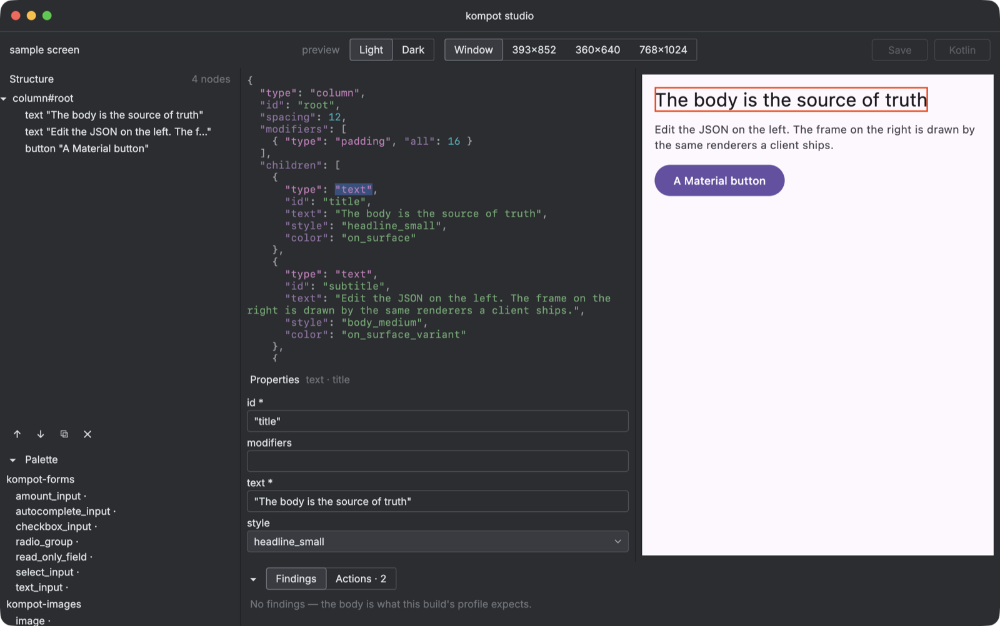

# kompot-studio

Редактор экрана для сервера, который иначе пишет дерево вслепую. Слева — структура тела и палитра
типов из профиля сборки, по центру — JSON и свойства выбранного узла, справа — экран, нарисованный
теми же рендерерами, что отгружает клиент. Снизу — что студия нашла: схема, правила, словарь,
деградации рендера.



Тело — источник истины. Дерево, палитра, инспектор и превью читают один и тот же текст и меняют
его же: перестановка узла в дереве — это splice в JSON, а не второе состояние, которое надо держать
в согласии с первым. Что студия умеет:

- открыть экран из файла, каталога записей или HTTP-источника с опросом по ETag;
- показать его в рамке потребителя — бренд, тема превью, размер устройства, состояние формы;
- проверить тело послойно: синтаксис → схема профиля → правила, которых схема не выражает →
  словарь слов и токенов сборки → то, что рендер сообщил о себе;
- собрать экран: перетащить тип из палитры в слот, переставить узел мышью или кнопками, править
  свойства по схеме;
- снять кадр и сравнить с голденом через viddik, если он есть в classpath;
- напечатать черновик серверной стороны на Kotlin DSL.

## Подключение

Студия — библиотека, которую запускает **сборка потребителя**: рендереры, бренд и записи экранов
живут там. Gradle-плагин добавляет задачу, а `KompotStudioConfigProvider` в сорс-сете говорит,
с чем её открыть.

```kotlin
// build.gradle.kts модуля с рендерерами
plugins {
    id("io.github.youndie.kompot.studio") version "<версия kompot>"
}

kompotStudio {
    target = "jvm"          // какой таргет запускать
    compilation = "test"    // где лежат рамка, записи и голдены — обычно в тестах
}
```

```kotlin
// src/jvmTest/kotlin/.../StudioProvider.kt, зарегистрирован в
// META-INF/services/io.github.youndie.kompot.studio.KompotStudioConfigProvider
class StudioProvider : KompotStudioConfigProvider {
    override val title get() = "kompot studio — my app"
    override fun studioConfig() = KompotStudioConfig(
        registry = myRegistry(),
        frame = { brand, dark, content -> MyBrandFrame(brand, dark) { content() } },
        brands = listOf("brand-a", "brand-b"),
        schemas = mySpec.schemas() + (KompotProtocol.PROFILE_FILE_NAME to mySpec.profile()),
        sources = listOf(ScreenSource.Directory(recordingsDir, name = "recorded")),
        samples = showcaseComponents().map { wireTypeOf(it) to it },
    )
}
```

```bash
./gradlew :client:kompotStudio
```

Окно рисует Jewel, а картинки за его иконками лежат только в репозитории IntelliJ — плагин
не может объявить репозиторий за сборку, поэтому одна строка в `settings.gradle.kts` остаётся
за потребителем:

```kotlin
maven("https://www.jetbrains.com/intellij-repository/releases") {
    content { includeGroup("com.jetbrains.intellij.platform") }
}
```

Запуск требует JetBrains Runtime 25 — плагин сам берёт его через toolchain, а на другой JVM окно
открывается без декораций и говорит об этом в консоли.

## Что важно знать

- **Тема окна — от системы**, переключатель `preview` в тулбаре меняет только экран внутри рамки.
- **Бренд** для студии — строка: список имён, рамка, которая их понимает, и правило имени голдена.
  Ничего бренд-специфичного в тулките нет — у другого потребителя это регионы или арендаторы.
- **Кадр с заглушкой пагинации не голден.** Если конфиг передаёт `pageLoader`-заглушку, студия
  предупреждает и просит подтвердить съёмку.
- **Черновик Kotlin — черновик.** Типы тулкита печатаются точно; имена классов потребителя —
  догадка по конвенции, помеченная `/* TODO: check this name */`.

Решения и их причины — в [бэклоге](../docs/backlog.md), задачи B-01…B-24.
